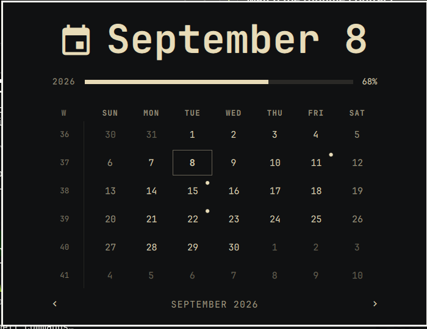
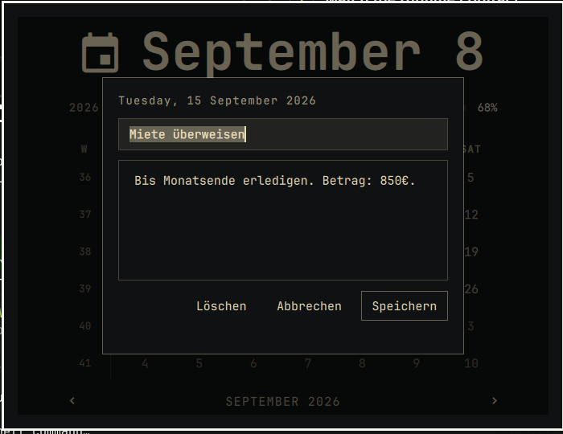

# Calendar Notes for Omarchy



A drop-in replacement for the Omarchy bar's built-in clock/calendar widget.
Same date label, same month-grid popup — but now every day is clickable.
Click a day, jot down a title and a note, and a small dot marks any day that
has one.



## Features

- Everything the stock Omarchy clock does: date/time label, right-click to
  cycle formats, middle-click for the timezone picker, the month-grid popup
  with ISO week numbers, year progress bar, and the memento-mori life bar.
- Click any day in the calendar popup to open a small note editor (title +
  text).
- Days with a note get a dot indicator, so you can see at a glance which
  days have something on them.
- Enter/Tab in the title field jumps to the text field, Ctrl+Enter saves,
  Escape cancels. A **Delete** button appears once a day has a note.
- Notes are stored locally in
  `~/.local/state/omarchy/settings/hannes-calendar-notes.json`, one JSON
  file, nothing fancier.

## Install

```sh
omarchy plugin add https://github.com/Hannes-swd/omarchy-calendar-notes.git --enable
```

Because the manifest declares itself as a clone of the built-in
`omarchy.clock`, enabling it swaps it in for the bar's default clock/calendar
slot automatically — no manual bar configuration needed.

Update an installed copy with:

```sh
omarchy plugin update io.github.hannes-swd.calendar-notes
```

Remove it (the stock clock comes back) with:

```sh
omarchy plugin remove io.github.hannes-swd.calendar-notes
```

## Local development

Validate the plugin from this repository:

```sh
./scripts/validate.sh
```

Install a local working copy:

```sh
plugin_id=io.github.hannes-swd.calendar-notes
plugin_dir="$HOME/.config/omarchy/plugins/$plugin_id"
mkdir -p "$plugin_dir"
rsync -a --delete --exclude .git --exclude screenshots --exclude scripts \
  ./ "$plugin_dir/"
omarchy-shell shell rescanPlugins
```

QML edits are not always picked up by `rescanPlugins` alone — if a change
doesn't seem to apply, run `omarchy-restart-shell`.

## Credits

Built on top of Omarchy's built-in `omarchy.clock` plugin (`omarchy plugin
clone omarchy.clock`), then extended with the note editor and persistence.
See [Omarchy's plugin development guide](https://plugins.omarchy.org/develop.html)
for the plugin API this is built against.

## License

MIT — see [LICENSE](LICENSE).
